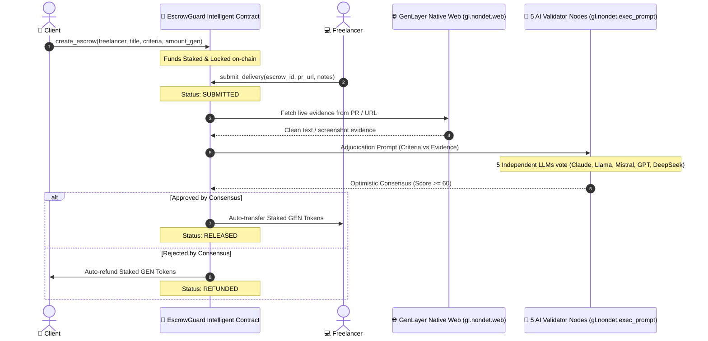

# 🛡️ EscrowGuard AI

> **Autonomous Freelance Milestone & Deliverable Escrow on GenLayer**  
> *Trustless dispute adjudication powered by GenLayer Intelligent Contracts, native web rendering, and decentralized AI validator consensus.*

[](https://genlayer.com)
[](https://escrowguard-ai.vercel.app)
[](https://studio.genlayer.com)
[](https://genlayer.com)
[](https://opensource.org/licenses/MIT)

---

## 📌 Executive Summary

Traditional freelance platforms (Upwork, Fiverr) rely on slow, expensive, and opaque centralized support staff to resolve milestone disputes. Web3 smart contracts on standard EVM chains cannot natively read the internet or evaluate non-deterministic deliverables like source code, documentation, or deployed applications.

**EscrowGuard AI** solves this by leveraging **GenLayer's Intelligent Contracts**. Clients lock escrow funds with plain-English acceptance criteria. When the freelancer delivers the work, GenLayer's AI validator jury:
1. Directly inspects the deliverable URL (GitHub PR, commit, live demo) using `gl.nondet.web.render()`.
2. Evaluates compliance against contractual criteria using `gl.nondet.exec_prompt()`.
3. Reaches consensus across independent LLM nodes via the **Equivalence Principle**.
4. Automatically releases payment or issues a refund on-chain with zero human mediation.

---

## 🏛️ Architecture & Flow



---

## ⚡ GenLayer Superpowers Leveraged

| Feature | Standard EVM / Solidity | GenLayer Intelligent Contract |
| :--- | :--- | :--- |
| **Language** | Solidity / Vyper (Deterministic only) | Python (`genlayer` SDK) |
| **Web Connectivity** | Impossible without centralized Oracles | Native direct web scraping (`gl.nondet.web.render`) |
| **Milestone Review** | Centralized manual arbitration | Decentralized 5-juror LLM consensus (`gl.nondet.exec_prompt`) |
| **Consensus Protocol** | Proof-of-Stake / Proof-of-Work | **Optimistic Democracy & Equivalence Principle** |
| **Dispute Cost** | High arbitration fees ($50-$500) | Zero arbitration fees (On-chain AI consensus) |

---

## 📂 Repository Structure

```
EscrowGuard AI/
├── contracts/
│   ├── escrow_guard.py     # Production GenLayer Python Intelligent Contract
│   └── README.md           # Contract deployment & testing documentation
├── src/
│   ├── App.tsx             # Cyberpunk Web3 DApp with live AI Jury Simulator
│   ├── main.tsx            # Vite entry point
│   └── index.css           # Tailwind CSS directives & custom styling
├── public/                 # Static assets & icons
├── tailwind.config.js      # Custom theme colors & breakpoints
├── vite.config.ts          # Vite configuration
└── package.json            # Node.js dependencies
```

---

## 🚀 Getting Started

### 1. Run the Frontend Locally

```bash
# Clone the repository
git clone https://github.com/MeniyaAnil/EscrowGuard-AI.git
cd "EscrowGuard AI"

# Install dependencies
npm install

# Start local development server
npm run dev
```

### 2. Deploy Contract to GenLayer Studio

1. Navigate to [GenLayer Studio](https://studio.genlayer.com).
2. Connect your wallet to the **GenLayer Bradbury Testnet**.
3. Create a new file in Studio named `escrow_guard.py`.
4. Copy and paste the contents from [`contracts/escrow_guard.py`](./contracts/escrow_guard.py).
5. In the **Run & Debug** tab, select `EscrowGuard` and click **Deploy**.
6. Interact with `create_escrow`, `submit_delivery`, and `adjudicate_escrow` directly in the Studio simulator.

---

## 🛡️ Security & Prompt Injection Defenses

Because GenLayer Intelligent Contracts process arbitrary internet content, `escrow_guard.py` incorporates strict safeguards:
- **SSRF Hardening**: Only valid HTTP/HTTPS schemes permitted.
- **Prompt Injection Defense**: Evaluator system prompts explicitly isolate untrusted web evidence within delimiters and instruct validators to ignore embedded instructions.
- **Bounded Inputs**: Payload length limits prevent context window overflow attacks.

---

## 📜 License
MIT License. Built for the **GenLayer Points Portal & Builder Track**.
